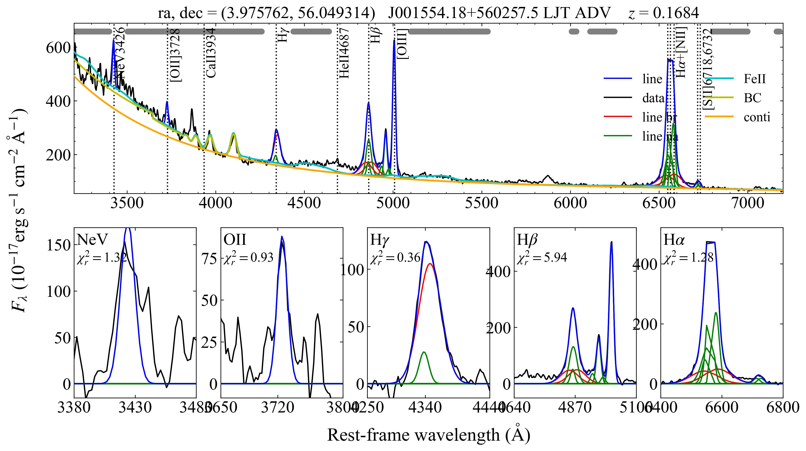

# QSOFITMORE
[](https://doi.org/10.5281/zenodo.15571037)  
A python package for fitting UV-optical QSO spectra. This package is developed based on [`PyQSOFit`](https://github.com/legolason/PyQSOFit) (v1.1), with some additional features for the LAMOST quasar survey ([Jin et al. 2023](https://ui.adsabs.harvard.edu/abs/2023ApJS..265...25J/abstract)) and the survey for quasars behind the Galactic plane ([Fu et al. 2022](https://ui.adsabs.harvard.edu/abs/2022ApJS..261...32F/abstract)). `qsofitmore` is now a standalone package with the same GNU license as `PyQSOFit`. For the latest version of `PyQSOFit`, please see https://github.com/legolason/PyQSOFit. 

### Features  
- Fit high-order (n_upper=6 to n_upper=50) Balmer emission line series using templates from Storey & Hummer (1995).
- Add FeII template from Verner et al. (2009) within [2000, 10000] AA.
- Add FeII template from Garcia-Rissmann et al. (2012) within [8100, 11500] AA.
- Add an optional broken power-law model in the continuum fitting process.
- Reading non-SDSS spectra without plateid, mjd and fiberid. 
- Narrow line measurements in the line MC process (which enables estimating uncertainties for narrow line parameters). 
- Dust maps and extinction laws other than SFD98 and CCM. 
- LaTeX rendering for line names in plots. 
- Linear wavelength fitting mode with line profile parameters in km/s (optional). Narrow-line width cap (default 1200 km/s). CSV/YAML helpers to edit and convert parameter lists.

## 1. Installation
Dependencies:
```
astropy
lmfit
dustmaps
uncertainties
```

Assuming you have anaconda installed (`astropy` included), the following steps demonstrate how to install dependencies above.
- Install these packages via conda:
```
conda install -c conda-forge lmfit dustmaps uncertainties
```

You can also install these packages via pip:
```
pip install lmfit dustmaps uncertainties
```

Download the SFD98 dust map:
```python
from dustmaps.config import config
config['data_dir'] = '/path/to/store/maps/in'

import dustmaps.sfd
dustmaps.sfd.fetch()
```

Check https://dustmaps.readthedocs.io/en/latest/installation.html for more dust maps.

After installing the dependencies, download and set up the `qsofitmore` package.

One-line installation with pip:

```
pip install git+https://github.com/rudolffu/qsofitmore.git
```

Alternatively, clone the repository and install manually:

```
git clone https://github.com/rudolffu/qsofitmore.git 
cd qsofitmore 
python -m pip install .
# for development use:
python -m pip install -e .
```

### Fitting Backends: lmfit (default) vs kmpfit

`lmfit` is now the default optimizer in qsofitmore, so a fresh install works out of the box with no Kapteyn dependency. The legacy Kapteyn `kmpfit` path is still available if you explicitly opt in.

1) Stay on the default lmfit backend (recommended):
   - Install qsofitmore normally (no extra dependencies).
   - Optional: disable Kapteyn-specific tox envs unless you need regression checks.

2) Use the legacy kmpfit backend (requires Kapteyn):
   ```bash
   pip install "cython<3.0"  # Kapteyn requires Cython < 3
   pip install https://www.astro.rug.nl/software/kapteyn/kapteyn-3.4.tar.gz
   # or via optional extra, if provided in your environment
   pip install .[legacy]
   ```

   Then disable lmfit explicitly either in Python or via environment variables:
   ```python
   # Force the legacy kmpfit path
   from qsofitmore.config import migration_config
   migration_config.use_lmfit = False
   ```
   or via environment variables before importing qsofitmore:
   ```bash
   export QSOFITMORE_USE_LMFIT=false
   # or more granular control
   export QSOFITMORE_USE_LMFIT_LINES=false
   export QSOFITMORE_USE_LMFIT_CONTINUUM=false
   ```

If you attempt to use kmpfit paths without Kapteyn installed, qsofitmore raises a clear ImportError with brief install instructions. Staying on the lmfit default avoids the dependency entirely.

CI and tox notes:
- kmpfit-specific tox envs install Kapteyn automatically.
- Example: `tox -e py311-kmpfit`

### Linear Wavelength Mode and km/s Parameters (optional)

For easier parameter limits and interpretation, you can fit emission lines on a linear wavelength axis and specify Gaussian widths/offsets in km/s.

Environment flags (set before importing qsofitmore):
```bash
export QSOFITMORE_WAVE_SCALE=linear            # axis for line fitting (log|linear)
export QSOFITMORE_VELOCITY_UNITS=km/s          # interpret inisig/minsig/maxsig/voff as km/s
export QSOFITMORE_NARROW_MAX_KMS=1200          # cap for narrow components (non-*br lines)
```

Parameter editing workflow:
- Use the CSV/YAML helpers to export, edit, and round-trip the parameter list.
- Converters are available to transform legacy ln(lambda) values to km/s:
  ```python
  from qsofitmore.line_params_io import (
      fits_to_csv, fits_to_yaml, csv_to_fits, yaml_to_fits,
      convert_csv_lnlambda_to_kms, convert_yaml_lnlambda_to_kms,
  )
  # Example: convert CSV and write back to FITS
  convert_csv_lnlambda_to_kms('qsofitmore/examples/output/qsopar.csv',
                              'qsofitmore/examples/output/qsopar.csv')
  csv_to_fits('qsofitmore/examples/output/qsopar.csv',
              'qsofitmore/examples/output/qsopar.fits')
  ```

Examples:
- `qsofitmore/examples/1b-edit_parlist_csv_yaml.ipynb`: edit parameters via CSV/YAML and regenerate FITS.
- `qsofitmore/examples/2b-fit_qso_spectrum_linear.ipynb`: run fitting in linear-axis mode with km/s parameterization.

## 2. Tutorial
 
This tutorial can be run under `examples` directory of `qsofitmore`. 

### 2.1 Generate line parameter file

In this example, we read a line parameter file in csv format and convert it to fits format. The csv file can be edited manually. The output fits file (`qsopar.fits`) will be used in the fitting process. You can also use the provided `qsofitmore/examples/output/qsopar.fits` file directly without running this step.

```python
import numpy as np
from astropy.io import fits
from astropy.table import Table
import pandas as pd
from pathlib import Path
path='./output/'
Path(path).mkdir(exist_ok=True)

df_line = pd.read_csv("qsofitmore/examples/output/qsopar.csv")

print(df_line)

     lambda compname  minwav  maxwav   linename  ngauss  inisig      minsig      maxsig    voff  vindex  windex  findex  fvalue
0   6564.61       Ha  6400.0  6800.0      Ha_br       3    1500   899.37737  2000.00000  1000.0     0.0     0.0     0.0   0.050
1   6564.61       Ha  6400.0  6800.0      Ha_na       1     300   149.89623   509.60000  2000.0     1.0     1.0     0.0   0.002
2   6549.85       Ha  6400.0  6800.0    NII6549       1     300    68.95227   509.60000  1500.0     1.0     1.0     1.0   0.001
3   6585.28       Ha  6400.0  6800.0    NII6585       1     300    68.95227   509.60000  1500.0     1.0     1.0     1.0   0.003
4   6718.29       Ha  6400.0  6800.0    SII6718       1     300    68.95227   509.60000  1500.0     1.0     1.0     2.0   0.001
5   6732.67       Ha  6400.0  6800.0    SII6732       1     300    68.95227   509.60000  1500.0     1.0     1.0     2.0   0.001
6   4862.68       Hb  4640.0  5100.0      Hb_br       3    1500   899.37737  2000.00000   500.0     0.0     0.0     0.0   0.010
7   4862.68       Hb  4640.0  5100.0      Hb_na       1     300    68.95227   509.60000  2000.0     1.0     1.0     0.0   0.002
8   4960.30       Hb  4640.0  5100.0   OIII4959       1     300    68.95227   509.60000  2000.0     1.0     1.0     0.0   0.002
9   5008.24       Hb  4640.0  5100.0   OIII5007       1     300    68.95227   509.60000  2000.0     1.0     1.0     0.0   0.004
10  4955.30       Hb  4640.0  5100.0  OIII4959w       1     300    68.95227   509.60000  2000.0     2.0     2.0     0.0   0.001
11  4995.24       Hb  4640.0  5100.0  OIII5007w       1     300    68.95227   509.60000  2000.0     2.0     2.0     0.0   0.002
12  4341.68       Hg  4250.0  4440.0      Hg_br       1    1500  1199.16985  7494.81146   509.6     0.0     0.0     0.0   0.050
13  4341.68       Hg  4250.0  4440.0      Hg_na       1     300    68.95227   509.60000  1500.0     1.0     1.0     0.0   0.001
14  3728.48      OII  3650.0  3800.0    OII3728       1     300    99.92083   509.60000  2000.0     1.0     1.0     0.0   0.001
15  3426.84      NeV  3380.0  3480.0    NeV3426       1     300    99.92083   509.60000  1500.0     0.0     0.0     0.0   0.001
16  2798.75     MgII  2700.0  2900.0    MgII_br       2    1500  1199.16985  4500.00000   509.6     0.0     0.0     0.0   0.050
17  2798.75     MgII  2700.0  2900.0    MgII_na       1     300    68.95227   509.60000  2000.0     0.0     0.0     0.0   0.002
18  1908.73     CIII  1700.0  1970.0    CIII_br       2    1500  1199.16985  4500.00000  4500.0    99.0     0.0     0.0   0.010
19  1549.06      CIV  1500.0  1700.0     CIV_br       3    1500  1199.16985  4500.00000  4500.0     0.0     0.0     0.0   0.050

# convert to fits
tb = Table.from_pandas(df_line)
tb.write(path+'qsopar.fits', overwrite=True)

```

### 2.2 Import `QSOFitNew` class from `qsofitmore` 


```python
from qsofitmore import QSOFitNew
import numpy as np
import matplotlib.pyplot as plt
import pandas as pd
from astropy.table import Table
```

The output path (`path`) should contain a line list file (`qsopar.fits` generated in `1-make_parlist.ipynb`). The output files (including fits table and plots) are stored in `path`. 


```python
path = "./output/"
```

### 2.3 Initialise an instance of `QSOFitNew` from a custom spectrum 

#### a) From numpy-array like data 
We can read an example spectrum in csv format using `pandas`, and load the data to `QSOFitNew` manually. The data should contain wavelength (in Å), flux and flux error. In this example, the flux and error are in the unit of erg/s/cm^2/Å. Because the code assumes the flux is in unit of 10^-17 erg/s/cm^2/Å, we need to multiply the flux and error by 1e17. The redshift, RA, DEC, and name of the quasar are also required. The `is_sdss` parameter is set to `False` because this spectrum is not from SDSS. The object `J001554.18+560257.5` is from the suvey for quasars behind the Galactic plane ([Fu et al. 2022](https://ui.adsabs.harvard.edu/abs/2022ApJS..261...32F/abstract)), and was observed with the 2.4m Lijiang Telescope (LJT) in China. The `path` parameter is set to the output path where the fits file and plots will be saved.


```python
df = pd.read_csv("./data/spec_J001554.18+560257.5_LJT.csv")
```


```python
df
```


| Index | lam         | flux         | err          |
|-------|-------------|--------------|--------------|
| 0     | 3665.797515 | 7.947896e-16 | 1.031744e-16 |
| 1     | 3668.657947 | 9.944345e-16 | 1.128481e-16 |
| 2     | 3671.518379 | 7.201746e-16 | 1.086394e-16 |
| 3     | 3674.378811 | 7.498753e-16 | 1.073345e-16 |
| 4     | 3677.239243 | 8.567060e-16 | 1.078132e-16 |
| ...   | ...         | ...          | ...          |
| 1895  | 9086.315977 | 3.270070e-16 | 3.116500e-17 |
| 1896  | 9089.176409 | 3.494074e-16 | 3.172321e-17 |
| 1897  | 9092.036841 | 3.376591e-16 | 3.185541e-17 |
| 1898  | 9094.897273 | 2.639512e-16 | 3.125944e-17 |
| 1899  | 9097.757705 | 3.047675e-16 | 3.164424e-17 |

1900 rows × 3 columns


```python
q = QSOFitNew(lam=df.lam, flux=df.flux*1e17, err=df.err*1e17, 
              z=0.1684, ra=3.97576206, dec=56.04931383,
              name='J001554.18+560257.5', is_sdss=False, path=path)
```

#### b) From IRAF multispec

If you have a spectrum generated by `IRAF`/`PyRAF`, in which case the 4 bands of the fits file are:  
BANDID1 = 'spectrum - background fit, weights variance, clean no'               
BANDID2 = 'raw - background fit, weights none, clean no'                        
BANDID3 = 'background - background fit'                                         
BANDID4 = 'sigma - background fit, weights variance, clean no'  
The first and fourth bands are flux and flux error, respectively, in unit erg/s/cm^2/Å.
You can simply load the data with the classmethod `QSOFitNew.fromiraf`, which does the unit conversion automatically.


```python
q = QSOFitNew.fromiraf(
      "./data/spec_J001554.18+560257.5_LJT.fits",
      redshift=0.1684, telescope='LJT', path=path)
```


### 2.4 Fit the spectrum 

#### Choose a dust map  
The code supports three Galactic extinction maps:

 - `"sfd"`: Schlegel, Finkbeiner & Davis (1998) dust map  (this is the default)  
 - `"planck"` or `"planck16"`: Planck GNILC dust map (Planck Collaboration 2016)  
 - `"planck14"`: Planck dust map (Planck Collaboration 2014)

```python
# use the default SFD98 map
q.setmapname("sfd")

# use the default Planck GNILC (2016) map
q.setmapname("planck")     # same as "planck16"

# explicitly use the older Planck (2014) map
q.setmapname("planck14")
```

 If you select `"planck"`/`"planck16"` or `"planck14"`, make sure you have:
 
 1. Installed and configured `dustmaps`  
 2. Downloaded the Planck dust maps via:
    ```python
    from dustmaps.config import config
    config['data_dir'] = '/path/to/store/maps'
    import dustmaps.planck
    dustmaps.planck.fetch()
    ```

#### Apply `q.Fit()`  

Derived quantities of narrow and broad lines, including FWHM, sigma, EW, and integrated flux (area), are calculated during the fitting process and stored in the output fits file. By specifying `MC = True` when calling `q.Fit()`, the code will also calculate the uncertainties of these quantities using Monte Carlo simulations. The uncertainties are stored in the output fits file as well.


```python
q.setmapname("planck")
q.Fit(name              = 'J001554.18+560257.5_LJT_ADV',
      deredden          = True,
      wave_range        = None,
      wave_mask         = None,
      Fe_flux_range     = [4434, 4684] , # Wavelength range of FeII flux saved to the output file
      decomposition_host= True,
      Mi                = None,
      npca_gal          = 5,
      npca_qso          = 20,
      include_iron      = True,          # enable FeII fitting
      iron_temp_name    = "V09",         # options: "BG92-VW01", "V09", "G12"
      poly              = False,
      broken_pl         = True,          # enable broken power-law
      BC                = True,          # enable Balmer continuum and high-order Balmer lines
      MC                = True,         # optional: enable Monte Carlo error estimation
      n_trails          = 20,
      linefit           = True,
      tie_lambda        = True,
      tie_width         = True,
      tie_flux_1        = True,
      tie_flux_2        = True,
      save_result       = True,
      plot_fig          = True,
      save_fig          = True,
      plot_line_name    = True,
      plot_legend       = True,
      save_fits_name    = None)
```

    

    

#### Print fitting results
Try: 
`q.result_table`


### 2.5 Other options in the fitting process

#### a) The broken power-law model

The broken power-law model is an optional feature in the continuum fitting process. It is enabled by setting `broken_pl = True` in `q.Fit()`. The default is `False`.

#### b) Choose the FeII template
The FeII template can be chosen by setting `iron_temp_name` in `q.Fit()`. The options are:
- `"BG92-VW01"`: the Boroson & Green (1992) and Vestergaard & Wilkes (2001) template (default). 
- `"V09"`: the Verner et al. (2009) template, which covers the wavelength range from 2000 to 10000 Å.
- `"G12"`: the Garcia-Rissmann et al. (2012) template, which covers the wavelength range from 8100 to 11500 Å.

#### c) The Storey & Hummer (1995) Balmer emission line series templates

The Storey & Hummer (1995) Balmer emission line series templates are enabled by setting `BC = True` in `q.Fit()`. The default value of `BC` is `False`. The default electron density is 10^9 cm^-3, and the default electron temperature is 10^4 K. To change the electron density to 10^10 cm^-3, use `q.set_log10_electron_density(ne=10)` before calling `q.Fit()`. Currently, only 10^9 and 10^10 cm^-3 are supported.

#### d) Configurable power-law pivot wavelength (single power-law model only)
By default the continuum power-law is normalized at 3000 Å. If your spectrum lies mostly in the NIR (e.g. > 7000 Å), you can change that pivot:

```python
# normalize continuum at 9800 Å instead of the default 3000 Å
q.set_pl_pivot(9800.0)
q.Fit(…)
```
This ensures all PL continuum calculations use your chosen pivot wavelength.


### Updates from v1.2.1 to v1.2.2:
- Added the Garcia-Rissmann et al. (2012) FeII template within [8100, 11500] AA.
- Added the `set_pl_pivot` method to set the pivot wavelength for the power-law continuum model.


### Updates from v1.1.0 to v1.2.1:
- Added the Verner et al. (2009) FeII template within [2000, 10000] AA.
- Added the Storey & Hummer (1995) Balmer emission line series templates from n_upper=6 to n_upper=50.
- Merged the `PyQSOFit.py` code into `fitmodule.py` to simplify the installation process. `qsofitmore` is now a standalone package with the same GNU license as `PyQSOFit`.

### Updates from v1.0.0 to v1.1.0:
- Added an optional broken power-law model in the continuum fitting process.  
- Enabled line property outputs for all narrow lines, OIII core+wing as a whole, and CIV br+na as a whole.  
- Used new criterion to verify narrow/broad components in self._PlotFig() to prevent narrow components from being plotted as red (broad) lines.  
- Changed prefix of comp_result from number to the complex name.  
- Bug fixes.
