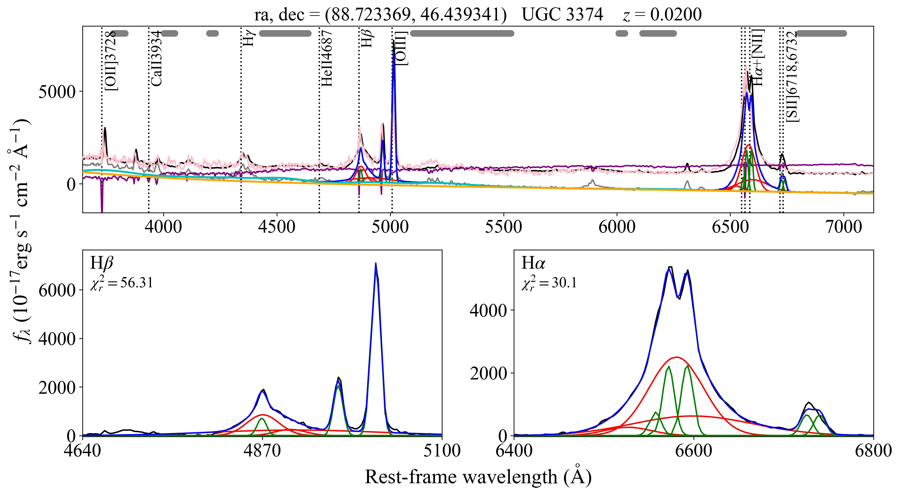

# QSOFITMORE
[](https://doi.org/10.5281/zenodo.4893734)   
A wrapper of PyQSOFit for customization

### Features  
- Reading non-SDSS spectra without plateid, mjd and fiberid. 
- Narrow line measurements in the line MC process (which enables estimating uncertainties for narrow line parameters). 
- Dust maps and extinction laws other than SFD98 and CCM. 
- LaTeX rendering for line names in plots. 

### To do:  
- Parallel the MC processes.
- Intergrate narrow line measurements to the output fits file. 
- A simple tutorial of using `qsofitmore` with example(s).  


## 1. Installation
Currently, the fitting class of `qsofitmore` is a wrapper of that of `PyQSOFit`. Therefore `PyQSOFit` and its dependencies are required to run `qsofitmore`. 

Dependencies of `PyQSOFit`: astropy (included in anaconda), sfdmap, kapteyn, PyAstronomy. 

Dependencies of `qsofitmore`: uncertainties, dustmaps (optional, needed when using dust maps other than sfd, e.g. planck dust map). 

Assuming you have anaconda installed, the following steps demonstrate how to install dependencies above.

Install sfdmap: 
```
# Install sfdmap from conda-forge channel
conda install -c conda-forge sfdmap
# Install sfdmap with pip
pip install sfdmap
```

Install [kapteyn](https://www.astro.rug.nl/software/kapteyn/):  
```
# From kapteyn website
pip install https://www.astro.rug.nl/software/kapteyn/kapteyn-3.0.tar.gz
# From conda-forge (NOT tested)
conda install -c conda-forge kapteyn
```

Install [PyAstronomy](https://pyastronomy.readthedocs.io/en/latest/pyaCDoc/installingPyA.html) with pip: 
```
pip install PyAstronomy
```

```
conda install -c conda-forge uncertainties
```

After installing the dependencies, download and set up both `PyQSOFit` and `qsofitmore` packages.

```
mkdir ~/tools # or any other path you like
cd ~/tools 
git clone https://github.com/rudolffu/PyQSOFit.git 
git clone https://github.com/rudolffu/qsofitmore.git 
cp ~/tools/qsofitmore/qsofitmore/bin/pyqsofit-setup.py ~/tools/PyQSOFit/ 
cd ~/tools/PyQSOFit  
python pyqsofit-setup.py develop 
cd ~/tools/qsofitmore 
python setup.py develop  
```

Install dustmaps (optional):
```
pip install dustmaps
```


## 2. Tutorial
 
This tutorial can be run under `examples` directory of `qsofitmore`. For basics of `PyQSOFit`, see https://github.com/legolason/PyQSOFit/blob/master/example/example.ipynb

### 2.1 Generate line parameter file

The following script of generating `qsopar.fits` is based on https://github.com/legolason/PyQSOFit/blob/master/example/example.ipynb


```python
import numpy as np
from astropy.io import fits
path='./output/'

newdata = np.rec.array([(6564.61,'Ha',6400.,6800.,'Ha_br',3,5e-3,0.004,0.017,0.015,0,0,0,0.05),\
                        (6564.61,'Ha',6400.,6800.,'Ha_na',1,1e-3,5e-4,0.0017,0.01,1,1,0,0.002),\
                        (6549.85,'Ha',6400.,6800.,'NII6549',1,1e-3,2.3e-4,0.0017,5e-3,1,1,1,0.001),\
                        (6585.28,'Ha',6400.,6800.,'NII6585',1,1e-3,2.3e-4,0.0017,5e-3,1,1,1,0.003),\
                        (6718.29,'Ha',6400.,6800.,'SII6718',1,1e-3,2.3e-4,0.0017,5e-3,1,1,2,0.001),\
                        (6732.67,'Ha',6400.,6800.,'SII6732',1,1e-3,2.3e-4,0.0017,5e-3,1,1,2,0.001),\ 
                        (4862.68,'Hb',4640.,5100.,'Hb_br',3,5e-3,0.004,0.022,0.01,0,0,0,0.01),\
                        (4862.68,'Hb',4640.,5100.,'Hb_na',1,1e-3,2.3e-4,0.0017,0.01,1,1,0,0.002),\
                        (4960.30,'Hb',4640.,5100.,'OIII4959',1,1e-3,2.3e-4,0.0017,0.01,1,1,0,0.002),\
                        (5008.24,'Hb',4640.,5100.,'OIII5007',1,1e-3,2.3e-4,0.0017,0.01,1,1,0,0.004),\
                        # (4960.30,'Hb',4640.,5100.,'OIII4959w',1,3e-3,2.3e-4,0.002,0.01,1,1,0,0.001),\
                        # (5008.24,'Hb',4640.,5100.,'OIII5007w',1,3e-3,2.3e-4,0.002,0.01,1,1,0,0.002),\
                        (2798.75,'MgII',2700.,2900.,'MgII_br',1,5e-3,0.004,0.015,0.0017,0,0,0,0.05),\
                        (2798.75,'MgII',2700.,2900.,'MgII_na',2,1e-3,5e-4,0.0017,0.01,1,1,0,0.002),\
                        (1908.73,'CIII',1700.,1970.,'CIII_br',2,5e-3,0.004,0.015,0.015,99,0,0,0.01),\
                        (1549.06,'CIV',1500.,1700.,'CIV_br',2,5e-3,0.004,0.015,0.015,0,0,0,0.05),\
                        ],\
                     formats='float32,a20,float32,float32,a20,float32,float32,float32,float32,\
                     float32,float32,float32,float32,float32',\
                     names='lambda,compname,minwav,maxwav,linename,ngauss,inisig,minsig,maxsig,voff,vindex,windex,findex,fvalue')
#------header-----------------
hdr = fits.Header()
hdr['lambda'] = 'Vacuum Wavelength in Ang'
hdr['minwav'] = 'Lower complex fitting wavelength range'
hdr['maxwav'] = 'Upper complex fitting wavelength range'
hdr['ngauss'] = 'Number of Gaussians for the line'
hdr['inisig'] = 'Initial guess of linesigma [in lnlambda]'
hdr['minsig'] = 'Lower range of line sigma [lnlambda]'  
hdr['maxsig'] = 'Upper range of line sigma [lnlambda]'
hdr['voff  '] = 'Limits on velocity offset from the central wavelength [lnlambda]'
hdr['vindex'] = 'Entries w/ same NONZERO vindex constrained to have same velocity'
hdr['windex'] = 'Entries w/ same NONZERO windex constrained to have same width'
hdr['findex'] = 'Entries w/ same NONZERO findex have constrained flux ratios'
hdr['fvalue'] = 'Relative scale factor for entries w/ same findex'
#------save line info-----------
hdu = fits.BinTableHDU(data=newdata,header=hdr,name='data')
hdu.writeto(path+'qsopar.fits',overwrite=True)
```

### 2.2 Import `QSOFitNew` class from `qsofitmore` 


```python
from qsofitmore import QSOFitNew
import numpy as np
import matplotlib.pyplot as plt
import pandas as pd
from astropy.table import Table
```

The output path (`path`) should contain a line list file (`qsopar.fits` generated in `1-make_parlist.ipynb`). The output files (including fits table and plots) are stored in `path`. 


```python
path = "./output/"
```

### 2.3 Initialise an instance of `QSOFitNew` from a custom spectrum 

#### a) From numpy-array like data 
We can read an example spectrum in csv format using `pandas`, and load the data to `QSOFitNew` manually. The data should contain wavelength (in Å), flux and flux error (both in 10^{-17} erg/s/cm^2/Å). In this example, I have already converted the flux and error to 10^{-17} erg/s/cm^2/Å. The object of interest is UGC 3374, which has z=0.02004, ra=88.72336906, and dec=46.43934051.


```python
df = pd.read_csv("./data/UGC_3374_ccds.csv")
```


```python
df
```

|      | lam         | flux       | err       |
|------|-------------|------------|-----------|
| 0    | 3713.125682 | 575.093933 | 15.692233 |
| 1    | 3716.174602 | 595.614136 | 16.098293 |
| 2    | 3719.223522 | 583.948425 | 15.944775 |
| 3    | 3722.272442 | 596.417175 | 15.941905 |
| 4    | 3725.321363 | 599.870239 | 15.927223 |
| ...  | ...         | ...        | ...       |
| 1165 | 7265.117806 | 399.388733 | 7.409341  |
| 1166 | 7268.166726 | 385.701477 | 7.304856  |
| 1167 | 7271.215646 | 372.931519 | 7.231922  |
| 1168 | 7274.264566 | 395.445251 | 7.496907  |
| 1169 | 7277.313487 | 426.522888 | 7.874022  |

1170 rows × 3 columns


```python
q = QSOFitNew(lam=df.lam, flux=df.flux, err=df.err, 
              z=0.02004, ra=88.72336906, dec=46.43934051,
              name='UGC_3374', is_sdss=False, path=path)
```

#### a) From IRAF multispec

If you have a spectrum generated by `IRAF`/`PyRAF`, in which case the 4 bands of the fits file are:  
BANDID1 = 'spectrum - background fit, weights variance, clean no'               
BANDID2 = 'raw - background fit, weights none, clean no'                        
BANDID3 = 'background - background fit'                                         
BANDID4 = 'sigma - background fit, weights variance, clean no'  
The first and fourth bands are flux and flux error, respectively, in unit erg/s/cm^2/Å.
You can simply load the data with the classmethod `QSOFitNew.fromiraf`, which does the unit conversion automatically.


```python
q = QSOFitNew.fromiraf("./data/UGC_3374_ccds.fits",redshift=0.02004,telescope='1.3m',path=path)
```


### 2.4 Fit the spectrum 

#### Choose a dust map (default: sfd map)


```python
q.setmapname("sfd")
```

If you want to use planck dust map instead, make sure you have installed [`dustmaps`](https://dustmaps.readthedocs.io/en/latest/installation.html) and downloaded the files of planck dust map (see https://dustmaps.readthedocs.io/en/latest/installation.html). Then you can use `q.setmapname("planck")` to choose the planck map.

#### Apply `q.Fit()`  

By default, `QSOFit.Fit()` of `PyQSOFit` does not output derived quantities of narrow lines, including FWHM, sigma, EW, and integrated flux (area); the `q.line_prop()` method should be called to calculate these parameters after fitting.  

In `qsofitmore`, after specifying `MC = True` when calling `q.Fit()`, narrow line properties above are calculated during fitting and are stored in `path + objectname.fits`.


```python
q.Fit(name = None, deredden = True, wave_range = None, wave_mask =None, 
      decomposition_host = True, Mi = None, npca_gal = 5, npca_qso = 20,
      Fe_uv_op = True, poly = True, BC = False, MC = True, n_trails = 20, 
      linefit = True, tie_lambda = True, tie_width = True, 
      tie_flux_1 = True, tie_flux_2 = True,
      save_result = True, plot_fig = True, save_fig = True, 
      plot_line_name = True, plot_legend = False,
      # save_fig_path = figpath, 
      # save_fits_path = respath,
      save_fits_name = None)
```

    

    

#### Print fitting results
Try: 
`q.all_result_name`, `q.all_result`, `q.na_line_result`, `q.conti_result_name`, `q.gauss_result_name`


```python

```

